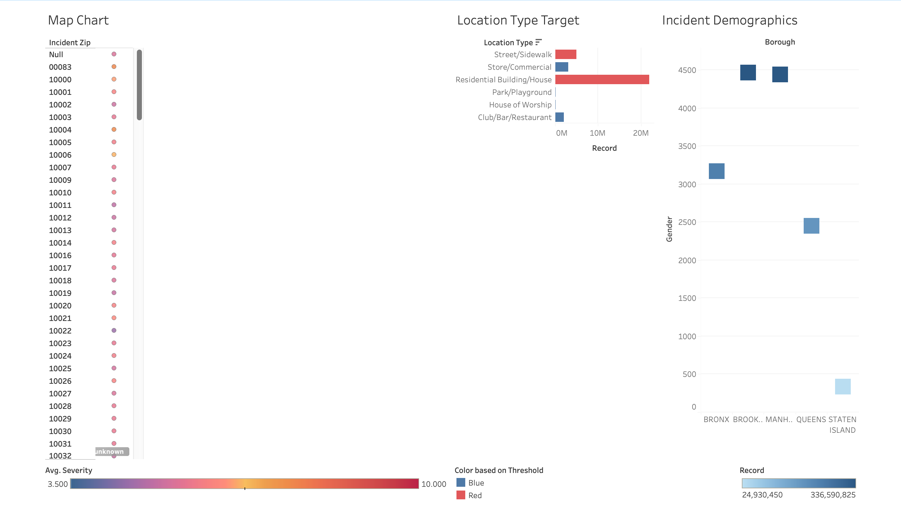

# New York City Incident Analysis

An interactive Tableau project analyzing incident patterns across the 5 boroughs of New York City. The goal of this project was to identify trends, compare incident activity across locations and categories, and present the findings through a clear, executive-style dashboard.

## Project Objective

The objective of this project was to transform raw incident data into an interactive Tableau dashboard that helps users quickly understand where incidents occur, how patterns change over time, and which categories contribute most to overall activity.

## Tools Used

- Tableau
- Data Visualization
- Data Cleaning
- Microsoft Office

## Analysis Performed

- Analyzed incident trends across New York City
- Compared incident activity across different locations
- Examined patterns across incident categories
- Used filters to allow interactive exploration of the data
- Created visualizations designed to highlight major trends and differences
  
### Dashboard 

The Tableau dashboard was designed to make incident patterns across New York City easy to explore and understand.

### Dashboard Features

- Interactive filters
- Geographic analysis
- Incident category comparisons
- Story explaining the significance of each chart on the dashboard

